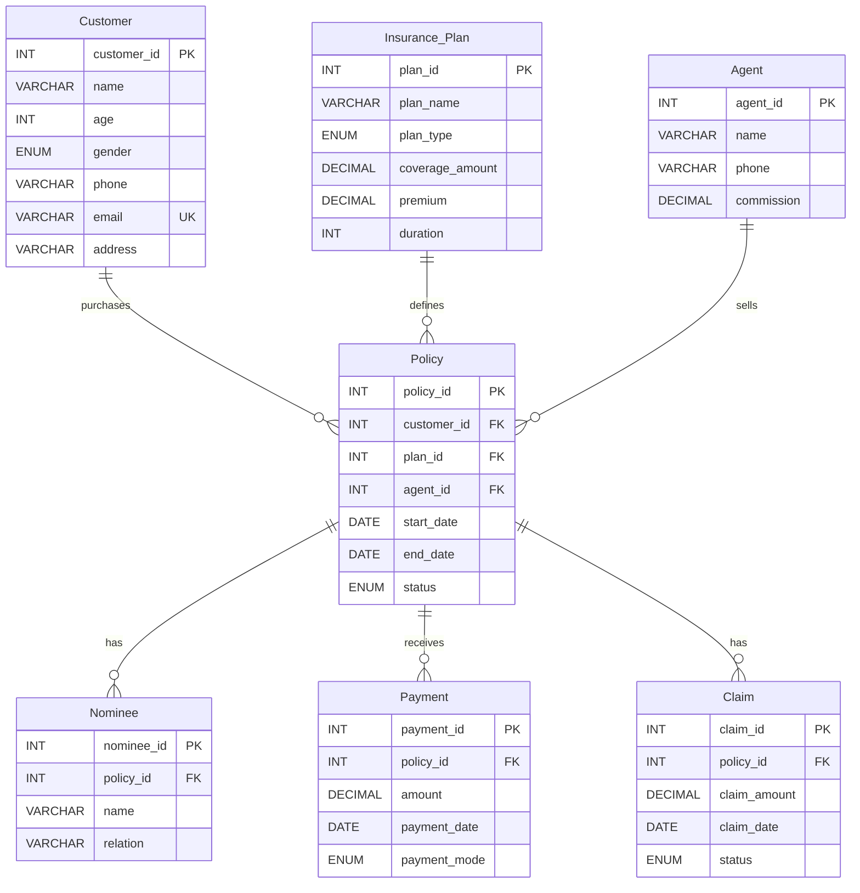

# ER Diagram — Insurance Policy Management System

## Entity-Relationship Diagram

## Relationships

| Relationship | Type | Description |
|---|---|---|
| Customer → Policy | 1:N | A customer can purchase multiple policies |
| Insurance_Plan → Policy | 1:N | A plan can be used in multiple policies |
| Agent → Policy | 1:N | An agent can sell multiple policies |
| Policy → Nominee | 1:N | A policy can have multiple nominees |
| Policy → Payment | 1:N | A policy can have multiple payments |
| Policy → Claim | 1:N | A policy can have multiple claims |

## Key Constraints

- **Customer.email** is UNIQUE
- **Customer.age** must be ≥ 18 (CHECK constraint)
- **Policy** deletion is RESTRICTED if referenced by Customer, Plan, or Agent
- **Nominee, Payment, Claim** cascade on Policy deletion (ON DELETE CASCADE)
- **Triggers** auto-set `end_date` and auto-expire policies
- **Event scheduler** runs daily to expire old policies
